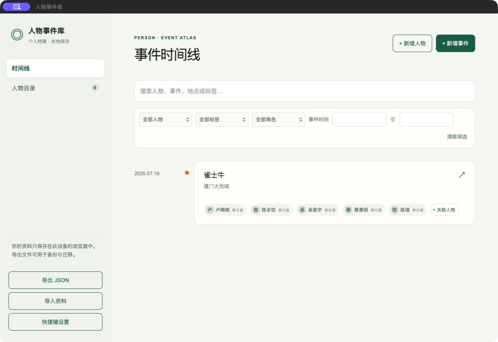
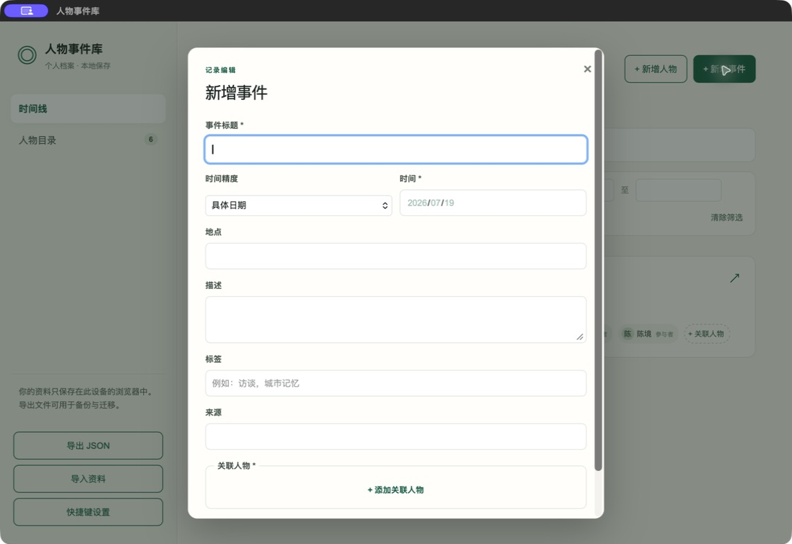
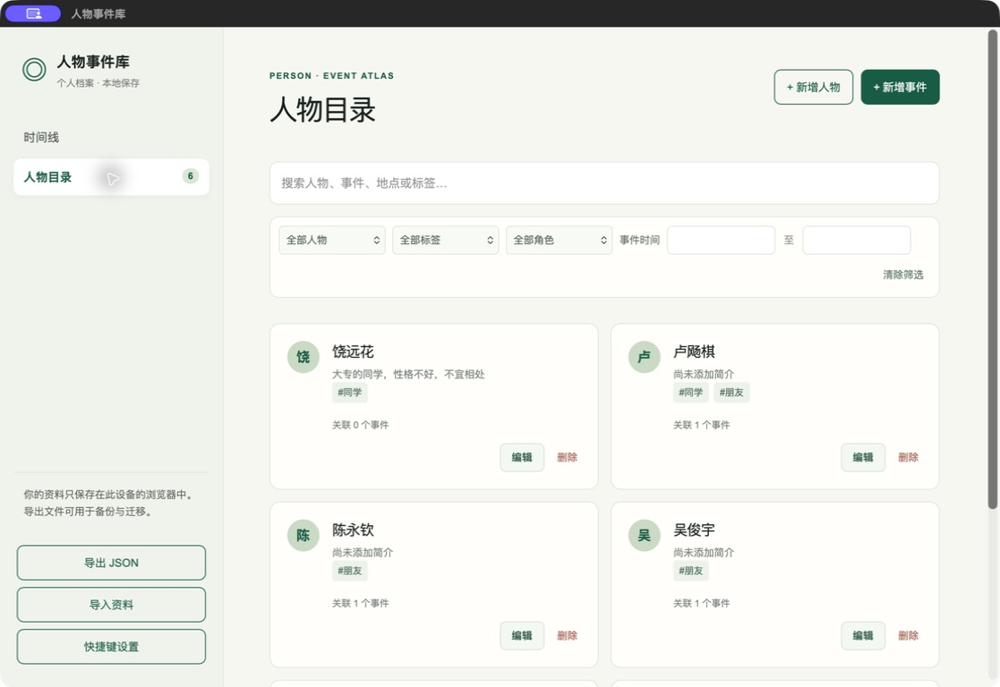

# 人物事件库

一个本地优先的个人档案工具：用时间线梳理人物、事件及其关系。资料默认保存在当前设备的浏览器中，不会自动上传。

## 功能

- 人物目录与事件时间线
- 支持年份、月份、具体日期和起止区间
- 为事件关联人物并标注角色
- 标签、地点、来源、备注与全文搜索
- 人物与事件的修订历史
- JSON 导入、导出与导入预检
- IndexedDB 顺序保存：仅在写入完成后显示保存成功

## 截图







## 开始使用

需要 Node.js 22.13 或更高版本。

```bash
npm ci
npm run dev
```

按终端输出的本地地址打开应用。生产构建与本地预览：

```bash
npm run build
npm run start
```

## 安装到设备

部署到 HTTPS 地址后，这个项目可作为应用安装，无需分别维护 Android、iOS、Windows 和 macOS 的界面代码：

- Android：在 Chrome 打开应用后选择“安装应用”。
- iPhone、iPad：在 Safari 打开应用，选择“分享”→“添加到主屏幕”。
- Windows、macOS：在 Chrome 或 Edge 地址栏中选择“安装”。

安装版支持离线打开和本地资料保存；跨设备时使用 WebDAV 同步，或导出、导入 JSON 备份。

## 数据与备份

- 示例资料均为虚构内容。
- 数据保存在此浏览器的 IndexedDB 中；清除浏览器站点数据会一并删除。
- 请定期使用“导出 JSON”备份。导入会先显示预检结果，确认后完整替换当前本地资料。

## WebDAV 多设备同步

在侧栏选择“WebDAV 同步”，填写一个可读写的远端 JSON 文件完整地址、用户名、WebDAV 密码和同步加密口令。首次同步会上传本机档案；两端资料不一致时，可选择用本机版本覆盖远端，或先下载本机备份再采用远端版本。应用只保存地址和用户名，两种密码仅用于当次同步。

Web 版本要求 WebDAV 服务允许此站点的跨域 `GET` 和 `PUT` 请求；桌面或移动端壳可直接使用同一同步逻辑。远端资料使用 AES-256-GCM 加密，口令遗失后无法恢复；仍建议使用 HTTPS 与可信的个人存储空间。

## macOS 桌面小组件

使用 [desktop/PersonEventAtlas.xcodeproj](desktop/PersonEventAtlas.xcodeproj) 在 Xcode 15+ 中运行 `PersonEventAtlas` target。首次启动会将已有 WebView IndexedDB 档案自动迁移到 App Group 共享资料库；小组件显示最近更新的事件，小型显示一条、中型显示三条。点击条目会通过 `person-event-atlas://event/<id>` 打开主应用对应详情。

首次构建需要本机可用的 Node.js 与 npm，Xcode 构建阶段会打包前端运行资源。选择开发团队后，运行主应用，再从 macOS 的小组件面板添加“最近更新”。

## 开发与验证

```bash
npm test
```

测试会先构建应用，再检查人物事件流程、日期区间和保存队列。

## 项目结构

- `app/page.tsx`：应用界面与本地数据流程
- `app/save-queue.mjs`：顺序保存队列
- `tests/`：核心行为测试
- `desktop/`：macOS Cocoa/WebKit 桌面壳源码
